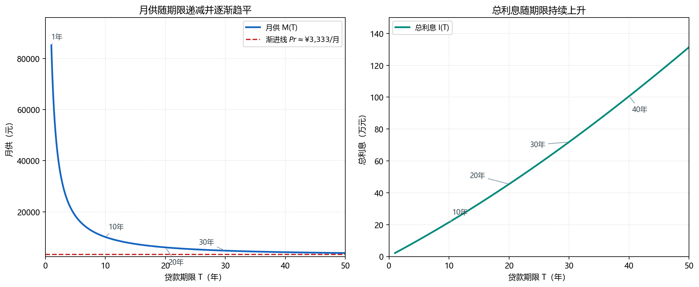

# 贷款月供和总年限的数学关系

**日期**：2026-08-31

## 一、基本设定

假设：

* 贷款本金：100万元
* 年利率：4%
* 还款方式：等额本息
* 按月还款
* 贷款期限：\(T\) 年

月利率为：

$$
r=\frac{4\%}{12}=0.3333\%
$$

总还款期数：

$$
n=12T
$$

---

## 二、月供公式

等额本息的月供为：

$$
M=P\frac{r(1+r)^n}{(1+r)^n-1}
$$

也可以写成：

$$
M=P\frac{r}{1-(1+r)^{-n}}
$$

其中：

* \(M\)：每月月供
* \(P\)：贷款本金
* \(r\)：月利率
* \(n\)：总月数

对于100万元、4%年利率：

$$
M(T)=1,000,000
\frac{0.04/12}
{1-(1+0.04/12)^{-12T}}
$$

这就是**贷款期限与月供之间的数学函数关系**。

---

## 三、贷款期限越长，月供越低，但下降越来越慢

计算结果：

| 贷款期限 |      月供 |
| ---: | ------: |
|   1年 | ¥85,150 |
|   3年 | ¥29,524 |
|   5年 | ¥18,417 |
|  10年 | ¥10,125 |
|  15年 |  ¥7,397 |
|  20年 |  ¥6,060 |
|  25年 |  ¥5,278 |
|  30年 |  ¥4,774 |
|  35年 |  ¥4,428 |
|  40年 |  ¥4,179 |
|  50年 |  ¥3,857 |

{: width="760" loading="lazy"}

这条曲线具有非常明显的**边际递减**特征。

例如：

* 10年 → 20年：月供下降约 ¥4,065
* 20年 → 30年：只下降约 ¥1,286
* 30年 → 40年：只下降约 ¥595
* 40年 → 50年：只下降约 ¥322

所以，把贷款期限从10年延长到20年，对降低月供非常有效；但从30年继续拉长，效果已经越来越有限。

---

## 四、为什么会出现这种曲线？

把公式写成：

$$
M(T)=P\frac{r}{1-(1+r)^{-12T}}
$$

当 \(T\) 增加时：

$$
(1+r)^{-12T}\rightarrow0
$$

因此：

$$
M(T)\rightarrow Pr
$$

对于100万元、4%年利率：

$$
Pr=1,000,000\times\frac{0.04}{12}
\approx ¥3,333
$$

也就是说，如果理论上把贷款期限无限延长，月供会无限接近：

$$
\boxed{¥3,333/月}
$$

但永远不会真正低于这个水平。

原因很简单：

**100万元本金在4%的年利率下，仅仅每个月产生的利息就约为3333元。**

期限再长，也不能让月供低于当月产生的利息，否则本金根本无法偿还。

---

## 五、一个很重要的直觉

贷款期限实际上是在做一个交换：

> **用更长的时间，换取更低的月度现金流压力。**

但是这种交换并不是线性的。

前期延长期限：

**月供下降很多。**

后期继续延长：

**月供下降越来越少。**

因此：

$$
\text{期限增加}
\quad\Rightarrow\quad
\text{月供下降}
$$

但：

$$
\text{月供下降的边际收益}\downarrow
$$

同时：

$$
\text{总利息}\uparrow
$$

这就是为什么30年期贷款在现金流上已经非常“长”，再继续延长，虽然仍然能够降低月供，但经济意义越来越小。

---

## 六、总利息的变化

100万元贷款、4%年利率下：

|  期限 |      总利息 |
| --: | -------: |
|  5年 |  ¥10.50万 |
| 10年 |  ¥21.49万 |
| 15年 |  ¥33.14万 |
| 20年 |  ¥45.44万 |
| 25年 |  ¥58.35万 |
| 30年 |  ¥71.87万 |
| 40年 | ¥100.61万 |
| 50年 | ¥131.42万 |

可以看到一个非常有意思的现象：

**月供曲线趋于平坦，但总利息仍然持续快速增加。**

例如：

30年 → 40年：

* 月供：¥4,774 → ¥4,179
* 每月只少还约 ¥595
* 但总利息增加约 ¥28.7万元

所以，“贷款期限越长越划算”显然不是数学上的结论。

---

## 七、真正值得观察的是边际变化

如果把月供记作：

$$
M(T)
$$

那么贷款期限增加一点点所带来的月供变化，可以理解为：

$$
\frac{dM}{dT}<0
$$

但随着 \(T\) 增大：

$$
\frac{dM}{dT}\rightarrow0
$$

也就是：

> **贷款期限越长，继续增加一年所能降低的月供越来越少。**

这正是图形上“曲线越来越平”的数学原因。

---

## 八、结论

对于固定利率的等额本息贷款：

$$
\boxed{
M(T)=P
\frac{r}{1-(1+r)^{-12T}}
}
$$

它是一条**单调下降、逐渐趋于水平的曲线**。

对于100万元、4%利率：

$$
\boxed{\text{月供最低的理论极限}\approx ¥3,333}
$$

因此，贷款期限从短期增加到中长期时，能够显著降低月供；但进入30年以后，继续增加期限的**边际降月供效果非常弱**，与此同时总利息仍然不断增加。

从数学上说，这就是一个典型的：

**“收益递减 + 渐近线”**问题。
