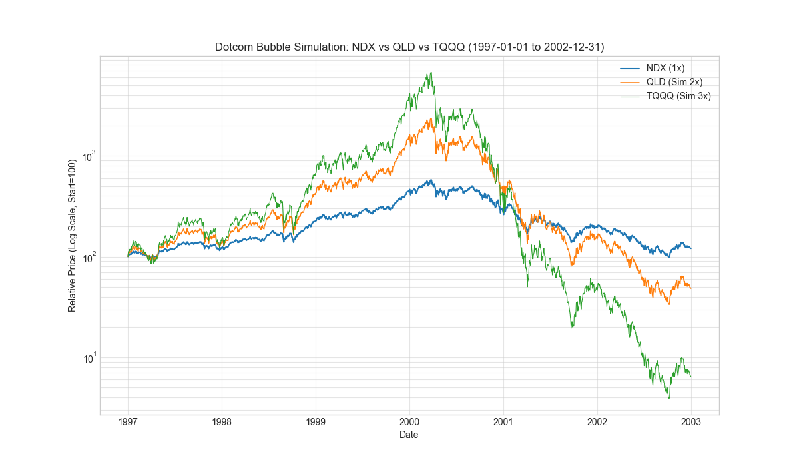
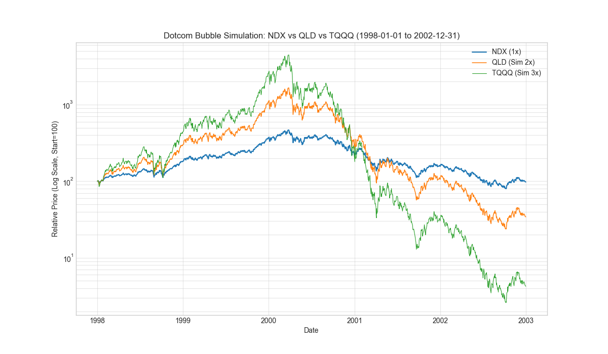
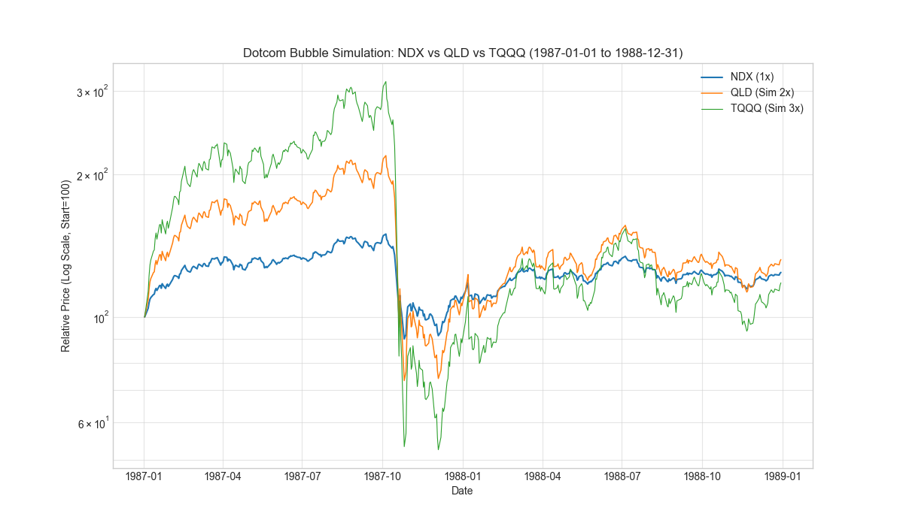

# 如果1998~2000有杠杆ETF

**日期**：2025-10-25

通过模拟计算 1997-2002 年 and 1998-2002 年互联网泡沫期间，如果存在 QLD (2x NDX) 和 TQQQ (3x NDX) 的表现。

## 模拟数据对比

### 1. 1997年开始 (1997-01-01 至 2002-12-31)
- **NDX (1x)**: 最高收益 +476.84%，最大回撤 -82.90%，最终收益 **+20.69%**
- **QLD (2x)**: 最高收益 +2252.52%，最大回撤 -98.57%，最终收益 **-51.54%**
- **TQQQ (3x)**: 最高收益 **+6659.06%**，最大回撤 **-99.94%**，最终收益 **-93.60%**

---

### 2. 1998年开始 (1998-01-01 至 2002-12-31)
- **NDX (1x)**: 最高收益 +366.63%，最大回撤 -82.90%，最终收益 **-2.37%**
- **QLD (2x)**: 最高收益 +1557.54%，最大回撤 -98.57%，最终收益 **-65.85%**
- **TQQQ (3x)**: 最高收益 +4368.83%，最大回撤 -99.94%，最终收益 **-95.77%**

---

### 3. 1987年开始 (1987-01-01 至 1988-12-31)
- **NDX (1x)**: 收益 **+24.18%**，最高收益 +49.66%，最大回撤 -39.93%
- **QLD (2x)**: 收益 **+32.21%**，最高收益 +119.19%，最大回撤 -66.51%
- **TQQQ (3x)**: 收益 **+18.06%**，最高收益 **+214.18%**，最大回撤 -83.31%

---

## 结论
在互联网泡沫中，杠杆 ETF 展现了极端的风险。虽然 TQQQ 在泡沫顶点创造了近 67 倍的收益神话，但在随后的崩盘中，回撤高达 **-99.94%**，几乎让本金彻底归零。这证明了在极高波动率且伴随长期阴跌的环境下，杠杆 ETF 的损耗和回撤是毁灭性的。

然而，1987 年的例子（典型的闪崩后快速震荡回升）给出了不同的启示。如果是像 1987 年那样的急速大跌，**QLD (2x) 在一年之后的表现依旧比 QQQ (1x) 更好**（32.21% vs 24.18%），而 TQQQ 则因为更深的回撤和损耗，恢复速度较慢，表现略逊于 NDX。
