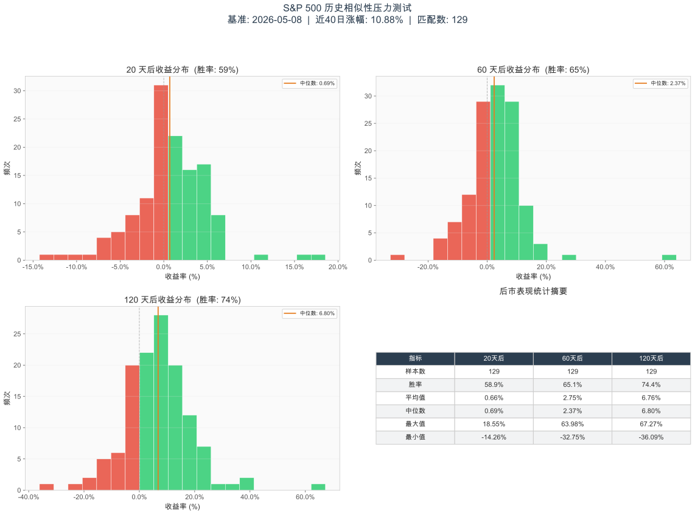

# 标普500暴涨分析260509

## 研究背景
在标普 500 指数近期录得显著涨幅（近 40 个交易日上涨 10.88%）的背景下，本研究旨在通过历史数据回溯，寻找历史上相似的上涨片段，并对其后的市场表现进行“压力测试”。

通过对 1920 年代至今的历史数据进行扫描，我们识别出了 129 个在窗口期（40日）涨幅与当前相似（容差 ±2%）的历史样本点。

## 核心可视化图表
以下图表展示了这 129 个历史相似点在触发后的路径走势：

## 统计发现：概率站在多头一边
根据对 129 个样本的统计分析，市场表现呈现出明显的“动量效应”：

| 指标 | 20个交易日后 | 60个交易日后 | 120个交易日后 |
|------|--------|--------|---------|
| **上涨概率 (胜率)** | 58.9% | 65.1% | **74.4%** |
| **平均收益率** | 0.66% | 2.75% | **6.76%** |
| **中位数收益率** | 0.69% | 2.37% | 6.80% |

**关键结论：** 随着持有时间的拉长，上涨的确定性显著增加。在相似的暴力拉升后，半年（120日）后的正收益概率接近 75%。

## 年代分布与历史韵脚
研究发现，此类暴涨行情并非孤例，但在不同宏观背景下结局各异：

1.  **1980s 繁荣期 (20次)**：平均 120 天后收益达 8.38%，反映了里根时代经济增长的强劲动量。
2.  **1930s 复苏期 (18次)**：平均 收益 10.57%，多发生在罗斯福新政初期的极端反弹中（如 1933 年最高单日 120 日收益达 67%）。
3.  **2020s 近期 (11次)**：平均收益 8.33%，显示当前市场的韧性与 80 年代相似。

## 风险警示
虽然平均数理想，但仍需警惕极端回撤。历史样本中：
- **最大跌幅**：曾在 60 天内出现过 -32.75% 的极端情况（多与 1937 年衰退及 1929 前夕相关）。
- **历史警示**：相似的涨幅也曾出现在 1928 年（1929 崩盘前夕）和 1987 年（黑色星期一前夕）。

## 总结
本研究通过相似性匹配证明，暴力拉升往往是行情中段而非终点。然而，投资者在享受动量红利的同时，必须时刻关注宏观因子的突变，以防雷同历史上的极端波动风险。

---
*相关详细数据参考：[定性分析报告](暴涨分析/spx_similarity_stress_test_report.md)*
