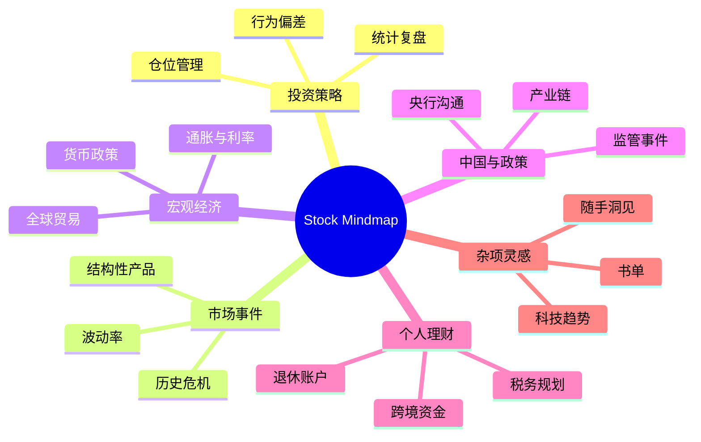

# 笔记思维导图

```mermaid
mindmap
  root((Stock Mindmap))
    投资策略
      行为偏差
      仓位管理
      统计复盘
    市场事件
      历史危机
      波动率
      结构性产品
    宏观经济
      通胀与利率
      货币政策
      全球贸易
    中国与政策
      监管事件
      央行沟通
      产业链
    个人理财
      跨境资金
      退休账户
      税务规划
    杂项灵感
      书单
      科技趋势
      随手洞见
```

> 如需查看具体文章，请返回 [分类索引](index.md) 或通过左侧导航选择对应目录。
